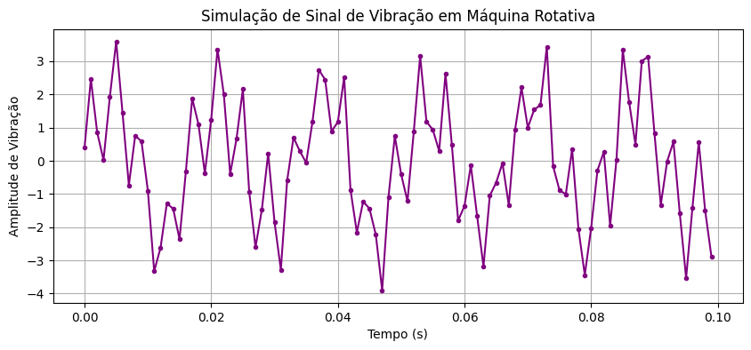
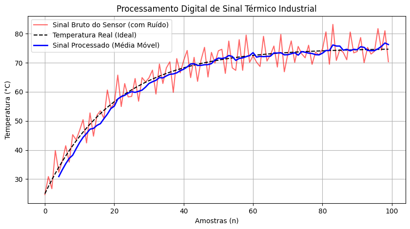
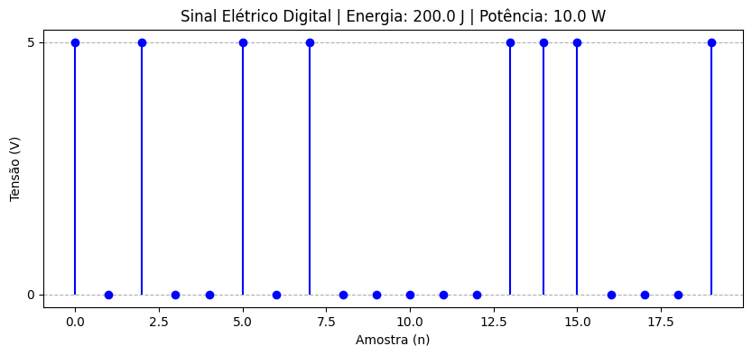
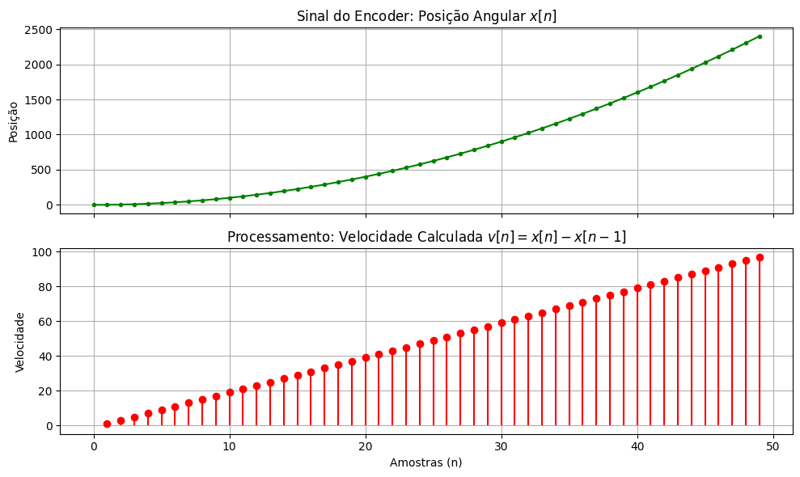
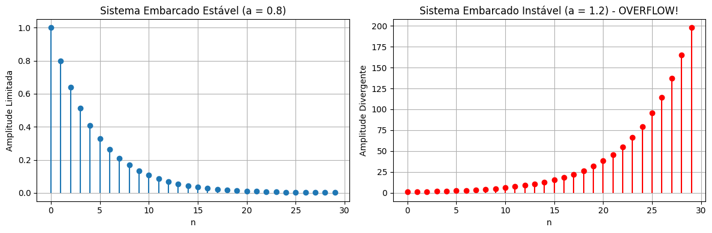

# Resultados e Discussão Técnica

Este documento apresenta a interpretação dos resultados obtidos nas simulações computacionais, relacionando os conceitos teóricos de Processamento Digital de Sinais (PDS) com a prática, além de classificar matematicamente os sistemas utilizados.

---

## 1. Simulação: Sinal de Vibração em Máquina Rotativa

**Discussão Técnica:**
O gráfico gerado ilustra o processo de amostragem de um sinal contínuo físico para o domínio discreto. A composição de duas frequências (60Hz do motor e 250Hz de um defeito mecânico) corrompidas por ruído aleatório simula a aquisição real por um sensor piezoelétrico. Fica evidente que, no tempo discreto, a informação contínua é mapeada em amostras discretas $x[n]$. A correta visualização e reconstrução desse sinal só é possível porque a frequência de amostragem ($Fs = 1000$ Hz) obedece ao Teorema de Nyquist, sendo superior ao dobro da maior frequência presente no sinal (250 Hz).

---

## 2. Simulação: Sinal Térmico e Filtro de Média Móvel

**Discussão Técnica e Classificação do Sistema:**
Nesta simulação, aplicamos um sistema para filtrar o ruído de alta frequência de um sensor de temperatura industrial.
* **Modelo do Sistema:** $y[n] = \frac{1}{5} \sum_{k=0}^{4} x[n-k]$
* **Classificação Matemática:**
  * **Com memória:** A saída atual depende de amostras passadas ($x[n-1], x[n-2]$, etc.).
  * **Causal:** Não utiliza amostras futuras, o que permite sua implementação em tempo real no chão de fábrica.
  * **Linear e Invariante no Tempo (LTI):** Respeita a superposição e o atraso.
  * **Estável (BIBO):** Uma entrada limitada sempre produzirá uma média limitada.
* **Interpretação:** O gráfico mostra claramente o sinal bruto (vermelho) oscilando fortemente devido à interferência da rede elétrica. A saída do sistema (azul) acompanha a curva real (preta) suavemente, demonstrando a eficácia do sistema com memória (filtro passa-baixas) em rejeitar ruídos.

---

## 3. Simulação: Sinal Elétrico Digital (Energia e Potência)
`

**Discussão Técnica:**
O gráfico no formato *stem* (hastes) evidencia a natureza essencialmente discreta de um sinal de dados digitais (0V e 5V) em um barramento de comunicação.
Para essa sequência finita de 20 amostras, o algoritmo calculou a **Energia Total** (somatório do quadrado das tensões) e a **Potência Média** (Energia dividida pelo número de amostras). 
Na teoria, como esse é um sinal de duração finita (um pacote de bits fechado), ele é formalmente classificado como um **Sinal de Energia Finita** (potência média tenderia a zero se o tempo fosse ao infinito, $N \to \infty$). Na prática computacional de janelamento, a potência média calculada reflete o consumo energético médio do hardware durante a transmissão desse pacote específico.

---

## 4. Simulação: Encoder e Derivador Discreto (Velocidade)

**Discussão Técnica e Classificação do Sistema:**
O sinal do *encoder* mede a posição angular cumulativa $x[n]$. Para obter a velocidade, utilizamos um sistema derivador discreto (diferença finita para trás).
* **Modelo do Sistema:** $v[n] = x[n] - x[n-1]$
* **Classificação Matemática:**
  * **Com memória:** Usa a amostra atual e a imediatamente anterior.
  * **Causal:** Apenas valores presentes e passados.
  * **Linear e Invariante no Tempo (LTI).**
* **Interpretação:** O primeiro gráfico mostra um crescimento quadrático da posição. Ao passar pelo sistema $v[n]$, o segundo gráfico exibe uma reta crescente. Isso valida computacionalmente o conceito do cálculo diferencial: a derivada de uma função quadrática é uma função linear.

---

## 5. Simulação: Sistemas Embarcados e Análise de Estabilidade (Overflow)
`

**Discussão Técnica e Classificação do Sistema:**
Aqui testamos a resposta ao impulso ($x[n] = \delta[n]$) de dois sistemas recursivos (IIR) para evidenciar a propriedade de **Estabilidade BIBO**.
* **Sistema 1 (Estável):** $y[n] = 0.8 \cdot y[n-1] + x[n]$. Como a magnitude do coeficiente multiplicador é menor que 1 ($|a| < 1$), a energia do sistema dissipa. O gráfico mostra a resposta decaindo para zero. É um sistema **estável**.
* **Sistema 2 (Instável):** $y[n] = 1.2 \cdot y[n-1] + x[n]$. O coeficiente é maior que 1 ($|a| > 1$). O gráfico mostra a amplitude crescendo exponencialmente a cada iteração de $n$. É um sistema **instável**.
* **Conclusão Prática:** Se o "Sistema 2" fosse implementado em um microcontrolador (sistema embarcado), esse crescimento ao infinito ultrapassaria o limite máximo de representação de bits da variável (seja 16-bits ou 32-bits), causando um erro crítico de *overflow* aritmético, travando o equipamento. Isso responde parte do Problema Norteador, reforçando que a análise prévia de estabilidade é mandatória no projeto digital.