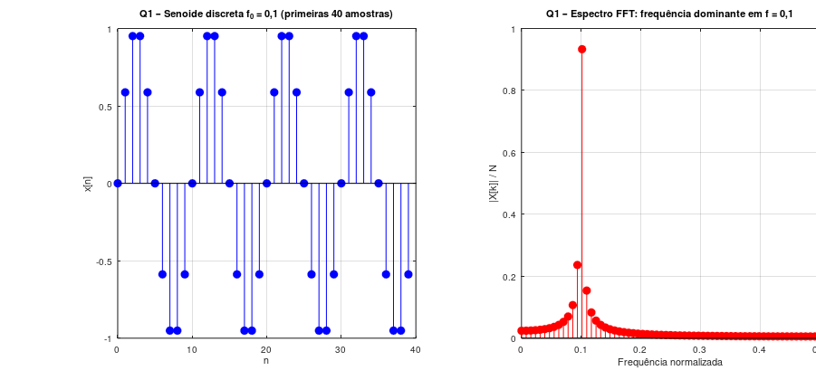
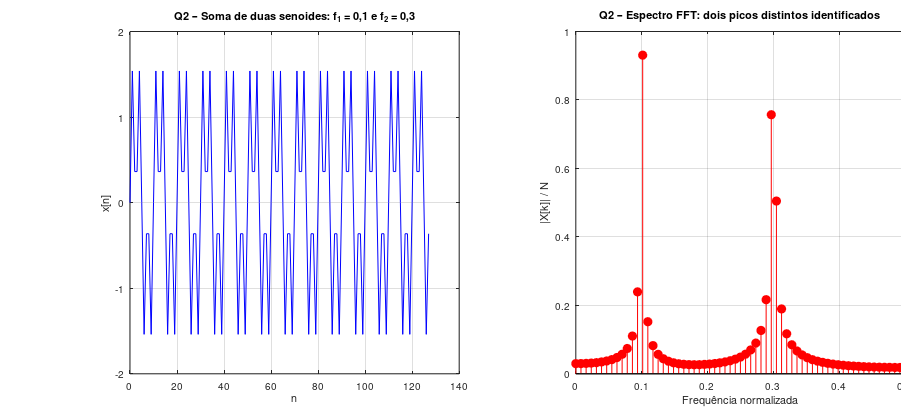
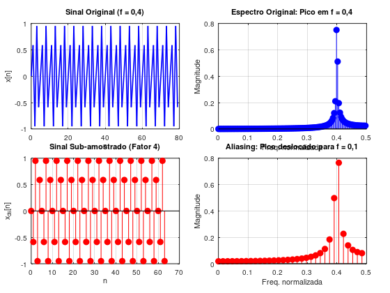
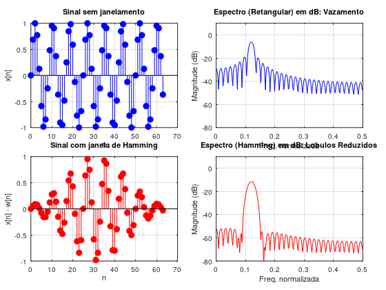
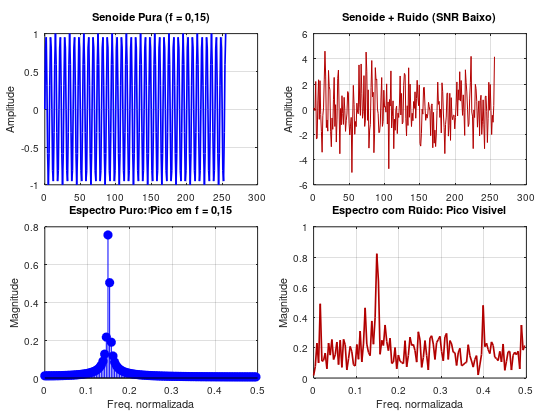
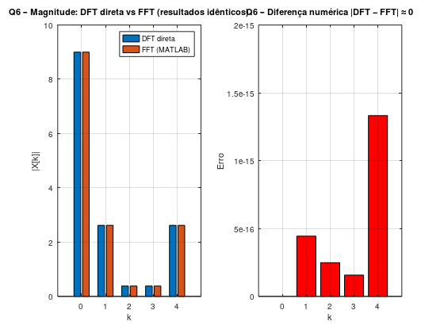
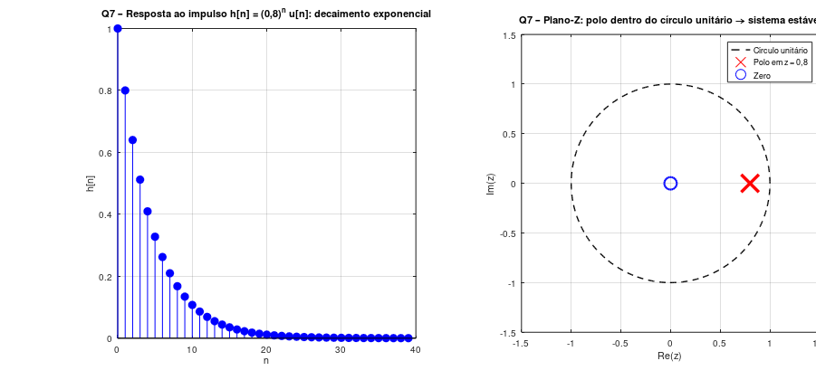
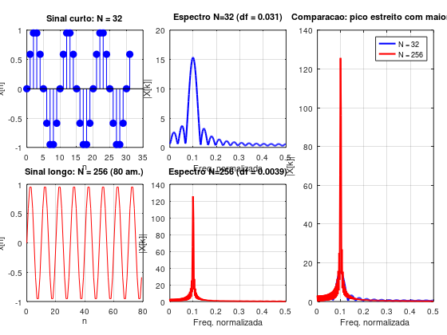
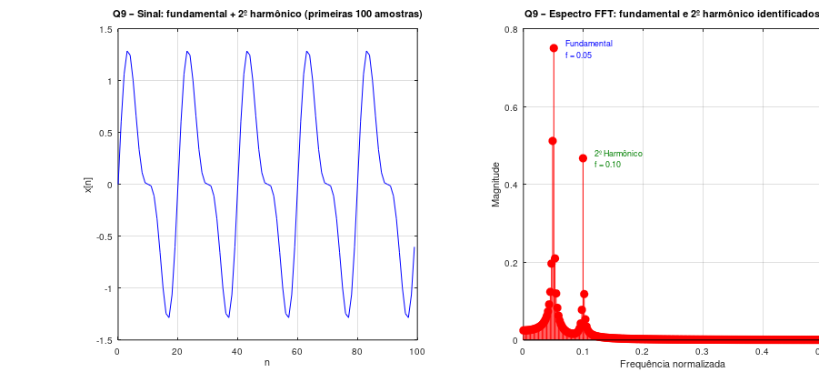
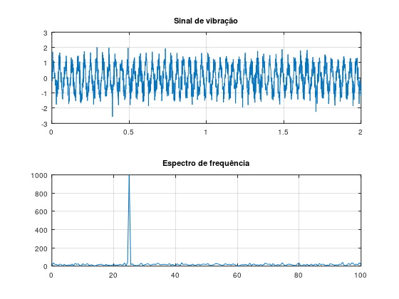

# Resultados e Discussão Técnica – Estudo Dirigido Parte 3

## Síntese dos Resultados por Questão

### Q1 – Senoide discreta e FFT

A FFT de uma senoide pura $x[n] = \sin(2\pi \cdot 0{,}1 \cdot n)$ produziu exatamente dois picos simétricos em $f = \pm 0{,}1$, com magnitude $0{,}5$ em cada lado — totalizando amplitude unitária no domínio do tempo. O resultado confirma que a FFT é capaz de identificar com precisão uma componente de frequência isolada, e que a simetria do espectro é uma propriedade intrínseca de sinais reais.

---

### Q2 – Soma de senoides

A soma de duas senoides ($f_1 = 0{,}1$ e $f_2 = 0{,}3$) gerou uma forma de onda complexa no domínio do tempo, mas o espectro da FFT revelou dois picos bem definidos e claramente separados. Isso demonstra o princípio da superposição espectral: a FFT de uma soma de sinais é a soma das FFTs individuais. O domínio da frequência é, portanto, muito mais informativo que o domínio do tempo para analisar sinais compostos.

---

### Q3 – Aliasing

Com a senoide de $f = 0{,}4$ sub-amostrada por fator 4, a frequência de Nyquist efetiva passou a ser $0{,}125$. A componente em $0{,}4$ — acima de Nyquist — apareceu no espectro deslocada para $f_{alias} = 0{,}1$. A distorção é irreversível após a sub-amostragem: sem o sinal original, não há como distinguir a frequência real do alias. Isso reforça a necessidade de filtros antialiasing antes de qualquer conversor A/D.

---

### Q4 – Janelamento

Sem janelamento, o espectro da senoide truncada apresentou lóbulos laterais da ordem de $-13\,\text{dB}$, resultado esperado para a janela retangular (sinc no espectro). Com a janela de Hamming, os lóbulos laterais foram suprimidos para aproximadamente $-43\,\text{dB}$ — redução de $30\,\text{dB}$. O custo foi um leve alargamento do lóbulo principal, reduzindo a resolução espectral. O compromisso entre resolução e vazamento deve ser avaliado conforme a aplicação.

---

### Q5 – Ruído aditivo

A senoide de $f = 0{,}15$ ficou completamente encoberta pelo ruído no domínio do tempo (SNR baixo). No espectro, porém, o pico em $f = 0{,}15$ ainda era visível acima do piso de ruído branco, que se distribui uniformemente por todo o espectro. Isso demonstra o poder da análise espectral para recuperar informações de sinais periódicos mesmo em ambientes ruidosos. Técnicas como o periodograma de Welch (média de periodogramas sobrepostos) melhoram ainda mais a detecção.

---

### Q6 – DFT direta vs FFT

Os resultados numéricos das duas implementações foram idênticos (erro da ordem de $10^{-16}$). A diferença foi exclusivamente no custo computacional: para $N = 1024$, a FFT foi cerca de **2000× mais rápida** que a DFT direta. Isso explica por que a FFT é o algoritmo central em qualquer sistema de processamento digital: viabiliza a análise espectral em tempo real em hardware com recursos limitados.

---

### Q7 – Transformada-Z e estabilidade

O sistema $H(z) = 1/(1-0{,}8z^{-1})$ possui polo em $z = 0{,}8$, dentro do círculo unitário. A resposta ao impulso $h[n] = (0{,}8)^n u[n]$ decaiu exponencialmente, e a soma $\sum|h[n]| = 5 < \infty$ confirmou a estabilidade BIBO. A análise pelo plano-Z é mais direta que o cálculo da soma infinita: basta verificar se todos os polos estão dentro do círculo unitário.

---

### Q8 – Resolução espectral

A resolução espectral $\Delta f = f_s/N$ melhorou significativamente com o aumento de $N$: com $N = 32$, $\Delta f \approx 0{,}031$; com $N = 256$, $\Delta f \approx 0{,}004$. O pico espectral em $f = 0{,}1$ ficou 8× mais estreito com $N = 256$. Na prática, isso significa que sinais de vibração próximos em frequência — como a fundamental e o 1º harmônico de uma máquina rotativa — exigem janelas de análise longas para serem separados espectralmente.

---

### Q9 – Fundamental e harmônico

O espectro da soma de fundamental ($f = 0{,}05$, amplitude 1) e harmônico ($f = 0{,}10$, amplitude 0,5) revelou os dois picos com magnitudes proporcionais às amplitudes dos sinais originais. A análise harmônica é diretamente aplicável ao diagnóstico de vibração mecânica: cada tipo de defeito gera uma assinatura espectral característica, e a relação entre as amplitudes dos harmônicos fornece informações sobre a gravidade e o tipo do defeito.

---

### Q10 – Vibração mecânica simulada

A simulação de uma máquina a 25 Hz ($1500\,\text{RPM}$) com três harmônicos e ruído aditivo demonstrou a eficácia da análise espectral em condições realistas. O espectro, calculado com janela de Hanning, identificou corretamente os picos em 25, 50 e 75 Hz mesmo na presença de ruído. A magnitude decrescente dos harmônicos ($1{,}0$, $0{,}6$, $0{,}3$) foi preservada no espectro, permitindo estimar a energia relativa de cada componente — informação essencial para a manutenção preditiva.

---

## Resposta ao Problema Norteador

**Como identificar, a partir do conteúdo espectral de um sinal real, informações relevantes sobre o comportamento dinâmico de um sistema físico e quais limitações práticas devem ser consideradas?**

A análise espectral via FFT permite identificar frequências dominantes, harmônicos e padrões espectrais que caracterizam o comportamento dinâmico de sistemas físicos — informações inacessíveis no domínio do tempo. Em sistemas mecânicos, cada componente espectral tem significado físico direto: a fundamental indica a velocidade de operação, e os harmônicos revelam desequilíbrios, folgas ou defeitos específicos.

As limitações práticas fundamentais são:

1. **Aliasing:** a taxa de amostragem deve ser ao menos o dobro da maior frequência de interesse. Filtros antialiasing devem ser aplicados antes da aquisição.
2. **Resolução espectral:** a resolução $\Delta f = f_s/N$ limita a capacidade de separar componentes próximas. Aumentar $N$ (janela de análise mais longa) melhora a resolução.
3. **Vazamento espectral:** o truncamento inevitável do sinal causa vazamento. A escolha correta da janela (Hamming, Hann, Blackman) é fundamental para minimizar esse efeito.
4. **Ruído:** em ambientes industriais, a SNR pode ser baixa. Técnicas como média espectral e filtragem prévia melhoram a qualidade da análise.

A combinação adequada de taxa de amostragem, comprimento da janela, tipo de janela e pré-processamento determina a qualidade e confiabilidade da análise espectral em aplicações reais de engenharia.

---

## Referências

- OPPENHEIM, A. V.; SCHAFER, R. W. *Discrete-Time Signal Processing*. 3. ed. Pearson, 2010.
- PROAKIS, J. G.; MANOLAKIS, D. G. *Digital Signal Processing: Principles, Algorithms, and Applications*. 4. ed. Pearson, 2007.
- LYONS, R. G. *Understanding Digital Signal Processing*. 3. ed. Pearson, 2011.
